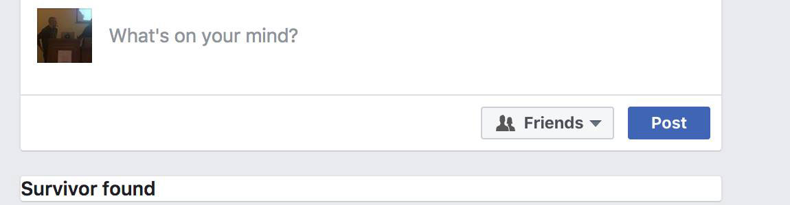

# SurvivorKiller Chrome extension

> SurvivorKiller is a Chrome extension that finds and terminates Survivor (Greek TV show) posts.

## How to install
* Download extension (Click 'Clone or download' button and then 'Download zip')
* Unzip
* Navigate to "chrome://extensions"
* Enable "Developer mode" checkbox at the top right corner
* Click "Load unpacked extension..."
* Browse and select extension folder (not the zip file)

## Contributing
* `git clone https://github.com/tkorakas/survivor-chrome-extension.git`
* Install as Google Chrome extension
* Make some changes 
* Reload plugin on Chrome `chrome://extensions`
* Sumbit a pull request

See the live video [here](https://www.youtube.com/watch?v=LkATcyD3vxU&feature=youtu.be).

# By SocialNerds
* [SocialNerds.gr](https://www.socialnerds.gr/)
* [YouTube](https://www.youtube.com/SocialNerdsGR)
* [Facebook](https://www.facebook.com/SocialNerdsGR)
* [Twitter](https://twitter.com/socialnerdsgr)

